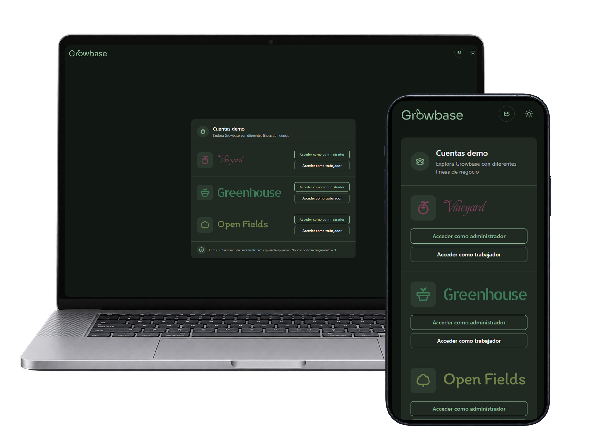
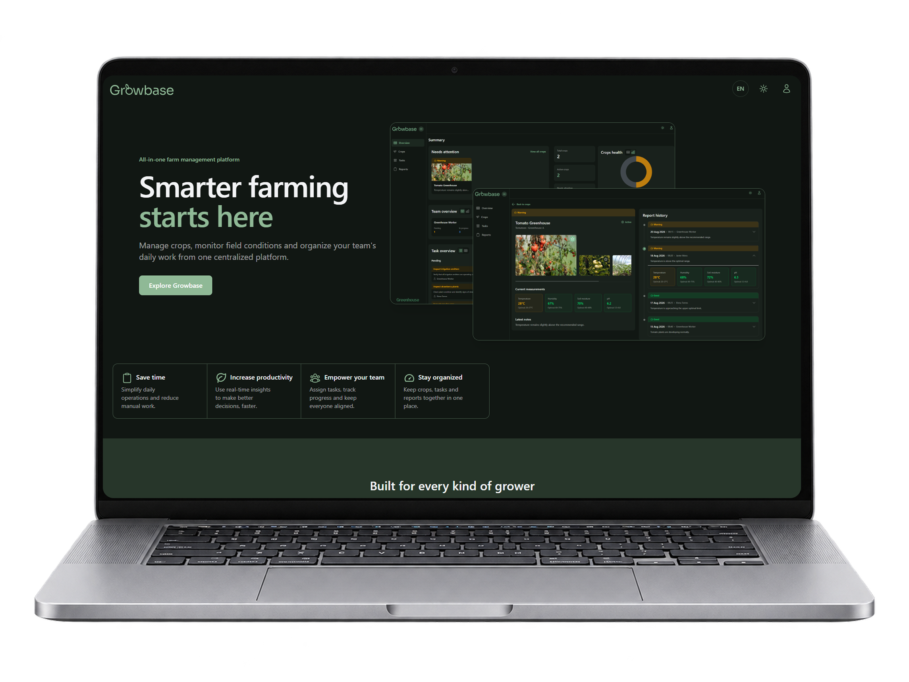
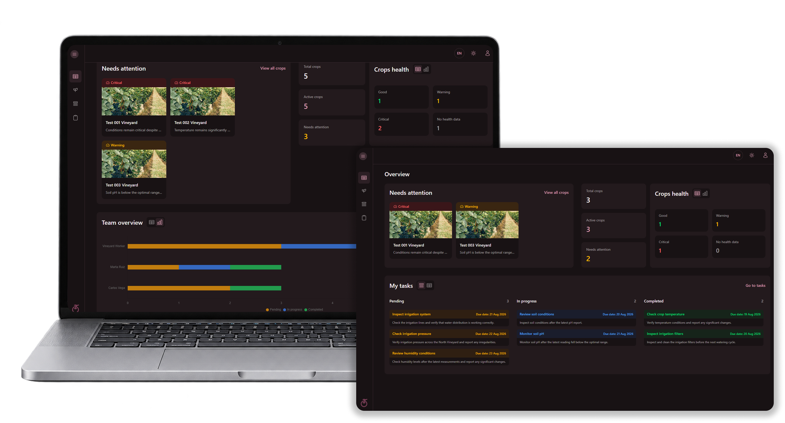
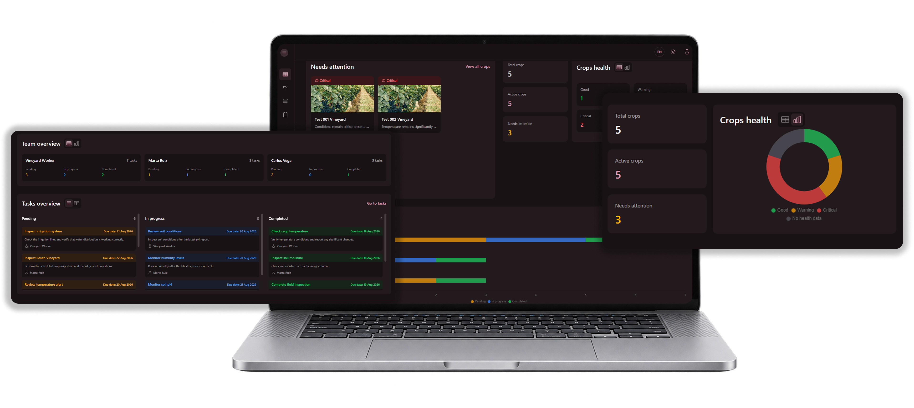
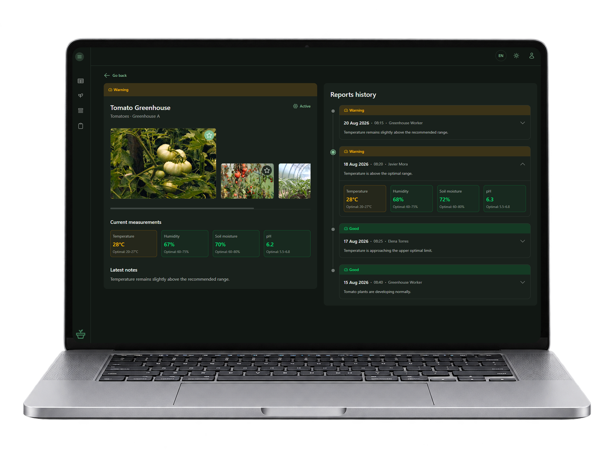
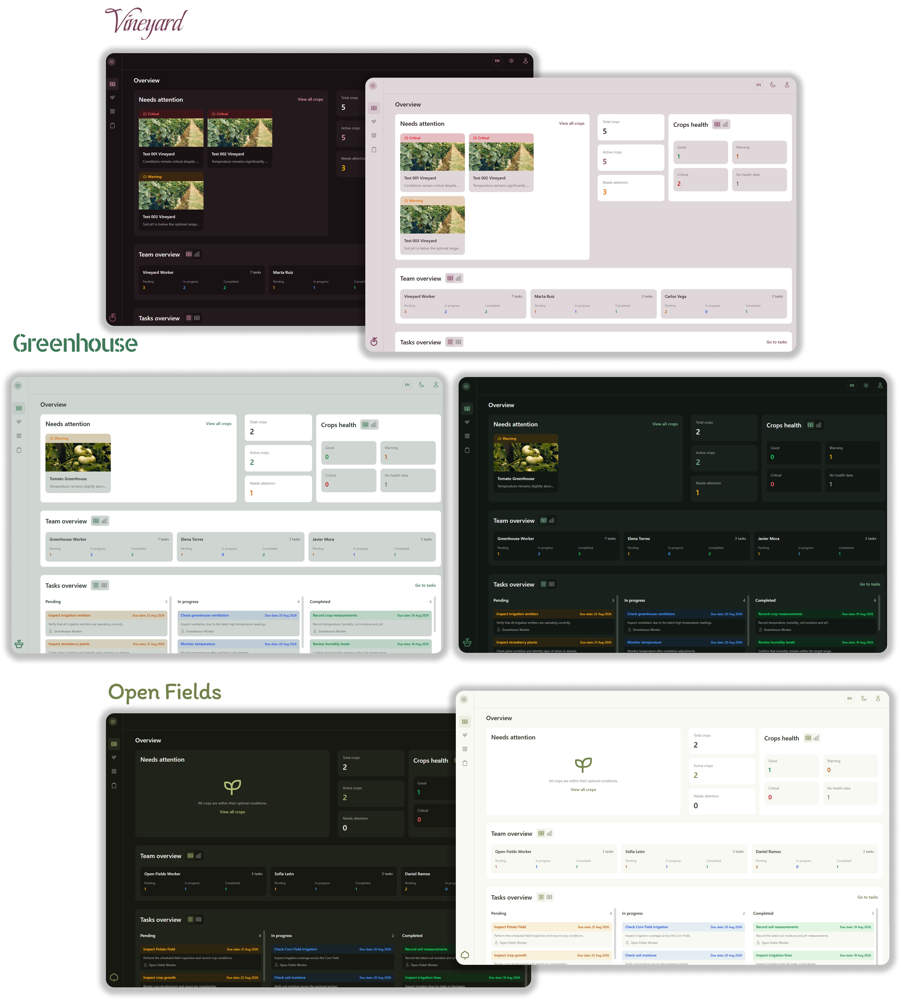
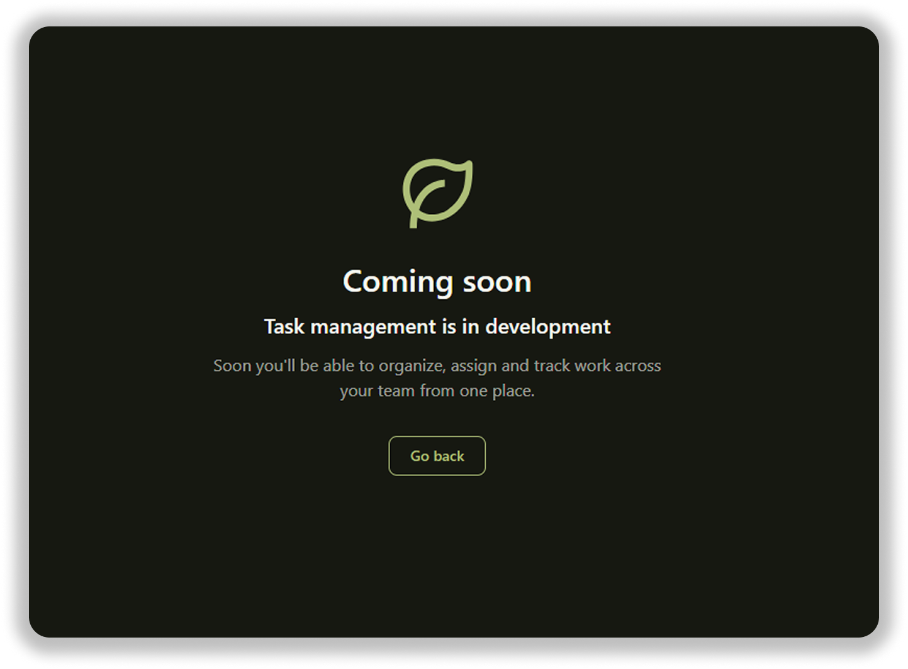
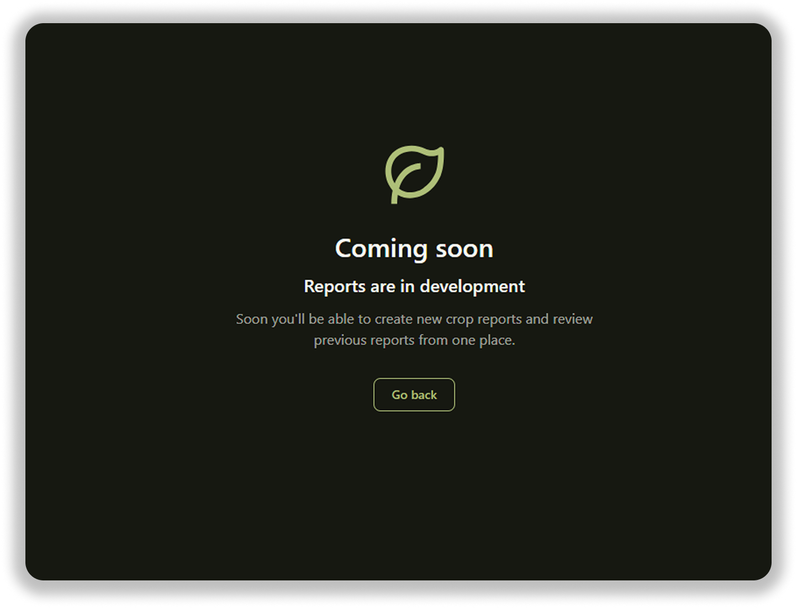

# Growbase 🌱

---

➜ [Demo](https://growbase-mu.vercel.app/)

Growbase is a farm management platform designed to centralize crop monitoring, field operations and team coordination.

The platform supports different agricultural business lines — Vineyard, Greenhouse and Open Fields — while keeping the same core workflow and adapting its visual identity to each one.

This prototype showcases role-based access, crop health monitoring, measurements and report history, task management, dynamic theming and internationalization.

---



---

## PROJECT SETTINGS ⚙️

This project uses:

- **Vue 3**
- **TypeScript 6**
- **Vite 8**
- **Node.js 24.18.0**
- **Vue Router**
- **Pinia**
- **Vitest**
- **ESLint**
- **Oxlint**
- **Prettier**
- **Tailwind CSS**
- **Chart.js**
- **i18n**

### Installation

```bash
npm install
```

### Run development server

```bash
npm run dev
```

```bash
npm start
```

---

## CODE QUALITY

This project uses **Prettier**, **ESLint** and **Oxlint** to keep the code consistent and clean.

### Check formatting

```bash
npm run format:check
```

### Fix formatting

```bash
npm run format
```

### Check lint

```bash
npm run lint
```

### Fix lint

```bash
npm run lint:fix
```

### Type checking

```bash
npm run type-check
```

---

## TESTING

This project uses **Vitest**.

### Running tests

```bash
npm run test:unit
```

### Running tests once

```bash
npm run test:unit:run
```

---

## GIT HOOKS

This project uses **Husky** to run quality checks before every commit.

The `pre-commit` hook checks:

- Prettier formatting
- ESLint and Oxlint
- TypeScript
- Unit tests

If any check fails, the commit is aborted.

---

## COMMITS

This project follows **Conventional Commits** using **Commitizen** and **Commitlint**.

To create a commit:

```bash
npx cz
```

Commit messages are validated automatically by the `commit-msg` hook.

Example:

```text
feat: add crop management
```

## CI/CD 🚀

This project uses **GitHub Actions**, **release-it** and **Vercel** for continuous integration, automated releases and deployment.

The workflow is defined in [`.github/workflows/ci.yml`](./.github/workflows/ci.yml) and runs on every push and pull request to `dev` and `main`.

### Continuous Integration

The `quality` job:

1. Installs dependencies with `npm ci`
2. Runs `npm audit` for high and critical vulnerabilities
3. Checks code formatting with Prettier
4. Runs Oxlint and ESLint
5. Runs TypeScript type checking
6. Runs unit tests with Vitest
7. Builds the application

If any check fails, the pipeline stops and the CI fails.

### Automated Releases

After a successful push to `main`, the `release` job runs automatically once the `quality` job has completed successfully.

Releases are managed with **release-it**:

```bash
npm run release -- --ci

## THEMING 🎨

This project uses **Tailwind CSS** with semantic design tokens and CSS variables.

Growbase has its own theme for public pages, while business line themes are loaded dynamically from application data.

Themes support both light and dark color schemes.
```

## 🔎 What will you find in Growbase?

### ➜ Landing page

A lightweight landing page introduces Growbase, its main benefits, supported business lines and key platform features before accessing the application.



### ➜ Role-based demo accounts

Explore the application as an **Admin** or **Worker** and see how the available information and actions adapt to each role.



### ➜ Farm dashboard

Get a quick overview of:

- Total and active crops
- Crops that need attention
- Crop health distribution
- Task status
- Team workload



### ➜ Crop monitoring

Browse crops and inspect their current status, location, images and health condition.

### ➜ Crop detail & measurements

Review the latest crop measurements, including:

- Temperature
- Humidity
- Soil moisture
- pH

Measurements are evaluated against the crop's optimal conditions to highlight potential issues.

### ➜ Report history

Review previous crop reports and compare historical measurements, notes and health conditions over time.



### ➜ Dynamic theming

The interface adapts its theme to the selected business line and supports both **light and dark mode**.

### ➜ Multi-business-line experience

Growbase supports three agricultural business lines:

- Vineyard
- Greenhouse
- Open Fields

Each one shares the same core functionality while using its own visual theme and data.



### ➜ Internationalization

The application is available in **English and Spanish**, with runtime language switching and persisted preferences.

## 🚧 Future Features

Growbase is currently a frontend prototype built around mock data and service abstractions. The architecture is prepared to progressively replace these mocks with real data sources without coupling the UI to a specific backend implementation.

### ➜ Task management

A dedicated task management area is planned to complement the task summaries already available on the dashboard.

Future functionality will include:

- Listing and filtering tasks
- Creating and editing tasks
- Assigning tasks to workers
- Updating task status
- Filtering tasks by crop, worker and status
- Tracking pending, in-progress and completed work



### ➜ Reports management

The reports section will provide a centralized place to create and review crop reports.

Planned functionality includes:

- Creating new crop reports
- Reviewing previous reports
- Filtering reports by crop and date
- Recording measurements and field observations
- Navigating historical crop information from a dedicated reports view



### ➜ Real API integration

The current prototype uses mock data behind dedicated services.

A future version will replace these mocks with a real backend API while preserving the existing application architecture:

`component → composable/store → service → API`

This will provide persistent data for:

- Users and roles
- Business lines
- Crops
- Tasks
- Measurements
- Crop reports

### ➜ Real authentication and authorization

The current demo accounts will eventually be replaced by a real authentication system with persistent user sessions and backend-enforced permissions for **Admin** and **Worker** roles.

### ➜ Real-time agricultural data

Crop measurements are currently simulated.

Future integrations could connect Growbase to real agricultural data sources or IoT devices to retrieve information such as:

- Temperature
- Humidity
- Soil moisture
- pH

This would allow crop health indicators and dashboard insights to be calculated from live field data.

### ➜ Notifications

Future versions could notify users about relevant events such as:

- Crops moving outside their optimal conditions
- New task assignments
- Upcoming or overdue tasks
- New crop reports

---

🙋🏻‍♀️ [Abigail Ojeda Alonso](https://es.linkedin.com/in/abigail-ojeda)
